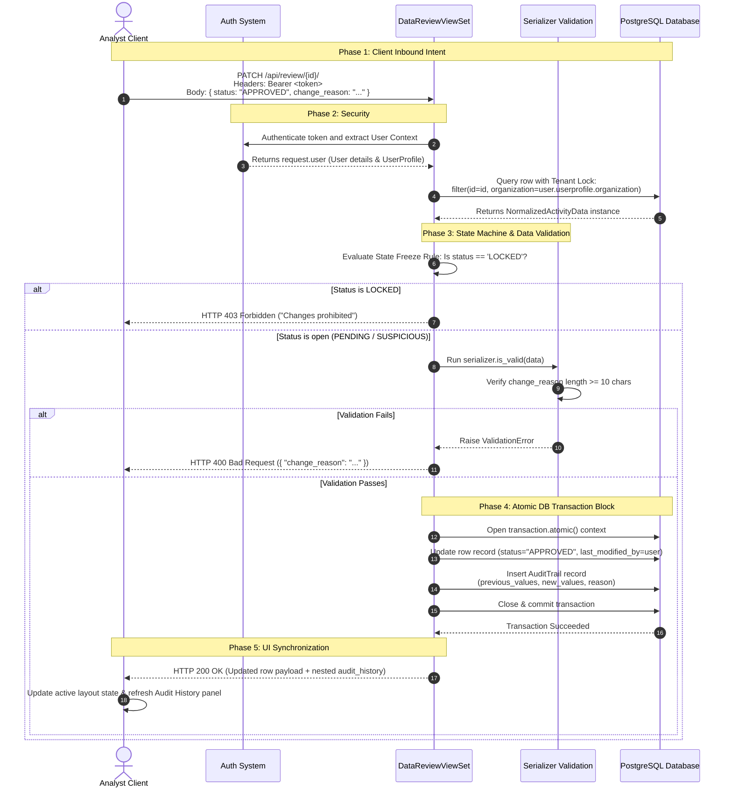

# Breathe ESG — Carbon Accounting & Audit Ledger Engine

## 1. Summary

The **Breathe ESG** engine is built to solve a fundamental problem in environmental compliance: **the unreliability of transactional carbon reporting.** In traditional enterprise software, data is mutable, schemas are flexible, and database isolation boundaries are enforced primarily at the application controller level. While this approach works for standard business tools, it fails under financial and environmental audit conditions. Greenhouse gas (GHG) calculations rely on a chain of custody where an input variation can alter downstream corporate reporting.

To eliminate these vulnerabilities, Breathe ESG treats carbon accounting like a financial general ledger:

* **The Principle of Raw Immutability:** Raw incoming data streams are preserved exactly as they were uploaded. They are never parsed on the fly or overwritten.
* **Deterministic State Transitions:** An activity record follows a strict lifecycle ($Pending \rightarrow Suspicious \rightarrow Approved \rightarrow Locked$). Once a record is marked as `LOCKED`, the state machine hard-blocks any further modifications.
* **Lineage Tracking:** Every calculated ton of $CO_2e$ is linked directly to its original data row via database foreign keys, allowing auditors to trace any metric back to its source file.

---

## 2. `MODEL.md` — Relational Data Model
For understanding the model decisions [Go to MODEL.md](./MODEL.md)

## 3. `DECISIONS.md` —  Ambiguity Resolution
For understanding the ambiguity and the solutions for it [Go to DECISIONS.md](./DECISIONS.md)

## 4. `TRADEOFFS.md` —  System Tradeoffs

For understanding the tradeoffs, [Go to TRADEOFFS.md](./TRADEOFFS.md)

---

## 5. `SOURCES.md` — Real-World Data Formats

For understanding the data source and data formats, [Go to SOURCES.md](./SOURCES.md)

---

## 6. Installation, Database Seeding, & Execution Verification

Follow these steps to deploy, seed, and verify the Breathe ESG engine locally.

### Step 1: Clone and Set Up the Python Virtual Environment

```bash
# Clone repository code
git clone https://github.com/your-org/breathe-esg-engine.git
cd breathe-esg-engine

# Initialize an isolated python runtime virtual env
python -m venv venv
source venv/bin/activate  # On Windows use: venv\Scripts\activate

# Install core framework requirements
pip install django djangorestframework djangorestframework-simplejwt django-cors-headers
```

### Step 2: Initialize Database Schemas

```bash
python manage.py makemigrations myapp
python manage.py migrate
```

### Step 3: Create the Sandbox Seeding Vector

Create a file named `seed_demo.py` in your root project folder (alongside `manage.py`) to seed the database with test accounts, matching organizations, and data sources:

```python
import os
import django

os.environ.setdefault('DJANGO_SETTINGS_MODULE', 'myproject.settings') # Replace with your configuration name
django.setup()

from django.contrib.auth.models import User
from myapp.models import Organization, UserProfile, DataSource

def seed_esg_ecosystem():
    print(" Initiating Breathe ESG Database Seeding...")

    # Create Multi-Tenant Anchor Organization
    org, created = Organization.objects.get_or_create(name="Apex Global Sustainability Corp")
    if created:
        print(f"  [+] Created Organization: {org.name}")

    # Provision Data Sources for Ingestion
    sources = [
        ('1', 'SAP ERP Core Instance', 'SAP'),
        ('2', 'Main Facility Grid Meter', 'UTILITY'),
        ('3', 'Corporate Concur Portal', 'TRAVEL')
    ]
    
    for src_id, name, src_type in sources:
        src, src_created = DataSource.objects.get_or_create(
            id=src_id,
            defaults={'organization': org, 'name': name, 'source_type': src_type, 'is_active': True}
        )
        if src_created:
            print(f"  [+] Provisioned Ingestion Target {src_id}: {name} [{src_type}]")

    # Provision User Profiles
    accounts = [
        ('lead_analyst_demo', 'BreatheESG2026!', 'lead.analyst@apex.com'),
        ('compliance_auditor_demo', 'SecureAudit2026!', 'auditor@external.com')
    ]

    for username, password, email in accounts:
        if not User.objects.filter(username=username).exists():
            user = User.objects.create_user(username=username, password=password, email=email)
            print(f"  [+] Created Core User: {username}")
            UserProfile.objects.create(user=user, organization=org)
            print(f"  [➔] Bound {username} to {org.name} Tenant Isolation Layer")

    print(" Seeding complete! Gateway credentials are live and active.")

if __name__ == '__main__':
    seed_esg_ecosystem()
```

Run the seed script:

```bash
python seed_demo.py
```

### Step 4: Run the Local Servers

```bash
python manage.py runserver
```

---

## 7. Mock Data

For testing purpose, mock data sources are stored in the [mock folder](./mock/)

## 8. System Flow



